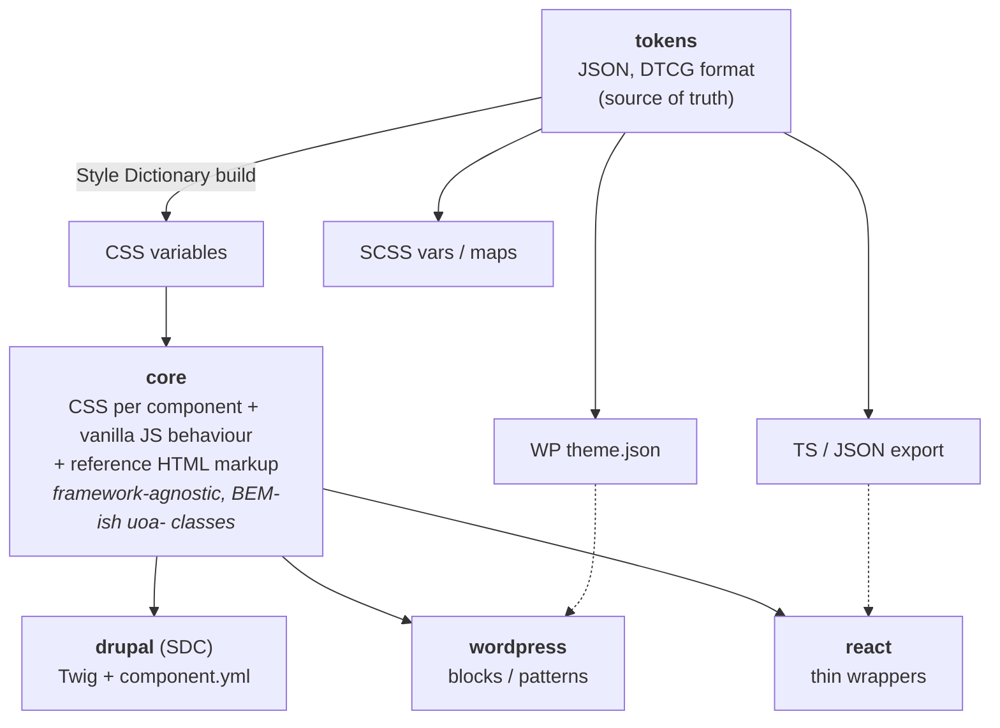

# Architecture & repo structure

## Layers



**Rules**

- Styles live **only** in `core`. Adapters output the core's markup and import its CSS.
- Everything must render correctly **without JS**; JS only enhances (e.g. accordion uses
  `<details>/<summary>` or visible content by default, JS adds animation/auto-collapse).
- Adapters never hard-code colours or sizes — tokens only.

### Why not Web Components or React as the core?

Drupal and WordPress render HTML on the server. A CSS + HTML core is consumed natively by
Twig and PHP, has no hydration, and survives with JS disabled. React wrappers are cheap to
add later on top of the same classes. If some interactive components (combobox, date
picker, modal) become hard to maintain in vanilla JS, those specific ones can become Web
Components (Lit) — they still work in Twig/PHP/React. Decide per component; record it in
an ADR.

## Proposed repo structure (Bun monorepo)

```
design-system-uoa/
├── docs/                       # these planning docs + ADRs
│   └── adr/                    # architecture decision records (0001-*.md …)
├── packages/
│   ├── tokens/                 # @uoa/tokens
│   │   ├── src/                # JSON tokens: primitive/, semantic/, component/
│   │   ├── build/              # Style Dictionary config
│   │   └── dist/               # css/, scss/, js/, wp/theme.json (generated, gitignored)
│   ├── icons/                  # @uoa/icons — SVG source + sprite build
│   ├── core/                   # @uoa/core — CSS + JS + reference markup
│   │   └── src/
│   │       ├── base/           # reset, typography, layout utilities, focus styles
│   │       └── components/
│   │           └── accordion/
│   │               ├── accordion.css
│   │               ├── accordion.js        # optional enhancement
│   │               ├── accordion.html      # reference markup
│   │   │               ├── accordion.test.js   # a11y + behaviour
│   │               └── README.md           # short pointer to the docs page
│   ├── drupal/                 # uoa_ds Drupal theme (base theme) with SDC
│   │   ├── uoa_ds.info.yml
│   │   ├── uoa_ds.libraries.yml
│   │   ├── components/
│   │   │   └── accordion/
│   │   │       ├── accordion.component.yml   # props/slots schema
│   │   │       └── accordion.twig
│   │   └── templates/          # overrides for core Drupal templates (menus, fields, forms…)
│   ├── wordpress/              # theme `uoa` + standalone plugin `uoa-blocks` (ADR 0003)
│   └── react/                  # (later) @uoa/react — wrappers over core classes
├── apps/
│   └── docs/                   # Astro + Starlight docs site (ADR 0001)
├── .changeset/                 # versioning / changelogs
├── package.json
├── bun.lock
└── README.md
```

### Drupal specifics

- Target **Drupal 10.3+ / 11**, use **Single Directory Components (SDC)** — each component
  has `*.component.yml` (JSON-schema props + slots) and a Twig file; CSS/JS are pulled from
  `@uoa/core` at build time.
- Ship as a **base theme** (`uoa_ds`); faculty/department sites create a sub-theme.
- Map Drupal render output (menus, pagers, form elements, status messages, fields) to our
  markup via template overrides — that is where most of the Drupal work actually is.

### WordPress specifics (ADR 0003)

- Plugin `uoa-blocks`, standalone: one block per core component, the class-scoped
  `uoa-components.css`, the behaviour modules. Works on any theme.
- Theme `uoa`: the page-level `uoa-base.css`, `theme.json` generated from tokens, templates and
  **block patterns**. Recommends the plugin.

### React specifics (later)

- Thin typed components rendering core markup/classes; interactive bits via a headless lib
  (Radix/React Aria) styled with our CSS — the shadcn approach.

## Tooling

| Concern | Suggestion |
| --- | --- |
| Package manager / monorepo | Bun workspaces (+ Turborepo if builds get slow) |
| Tokens | Style Dictionary v4, DTCG JSON format |
| CSS | Plain modern CSS (custom properties, `@layer`, nesting) + PostCSS; Sass optional |
| Docs site | Astro + Starlight, examples in iframes (ADR 0001) |
| Lint | Stylelint, ESLint, Prettier, twigcs for Twig |
| Tests | Playwright (visual regression + behaviour), axe-core for a11y |
| Versioning | Changesets, semver per package |
| CI | GitHub Actions: lint → build → test → publish docs site |
| Design | Figma library mirrored to tokens (Tokens Studio or Figma variables export) |
